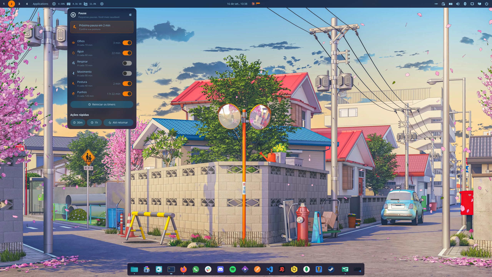

<div align="center">


# Pause

Small break reminders for the [COSMIC](https://system76.com/cosmic) desktop, so the day does not
go by without you moving.

</div>

Pause sits in the panel and reminds you to look after yourself while you work: rest your eyes,
drink water, take a deep breath, get up and move, check your posture, and relax your wrists.

Each reminder runs on its own schedule and can be switched on or off independently. Reminders
arrive as ordinary system notifications and never steal focus. Everything is configured from
the panel popup — there is no separate settings window.



## What it does

- Six reminders, each with its own interval
- Pause everything for half an hour, an hour, or until you say otherwise
- Nothing fires in a burst after the machine wakes from suspend or hibernation
- Exactly one notification per reminder, even with the panel on several monitors
- Twelve languages

## Installing

Without root, into `~/.local`:

```sh
just build-release
just install-user
```

System wide:

```sh
just build-release
sudo just install
```

Then add **Pause** in Settings → Desktop → Panel → Applets.

## Developing

```sh
just verify     # formatting, clippy, layering, tests, desktop entry and metainfo
just run-dump   # drive the scheduler with no display server
```

`ARCHITECTURE.md` explains the scheduling policy, the suspend behaviour, and the decisions
behind them.

## Translating

Catalogues live in `i18n/<locale>/pause.ftl`. Copy `i18n/en/pause.ftl`, translate the values,
and run `just test` — a test checks that every catalogue defines exactly the same message ids
as English, and that the handful of strings sitting in fixed width slots stay short enough not
to break the layout.

## Licence

GPL-3.0-only.
